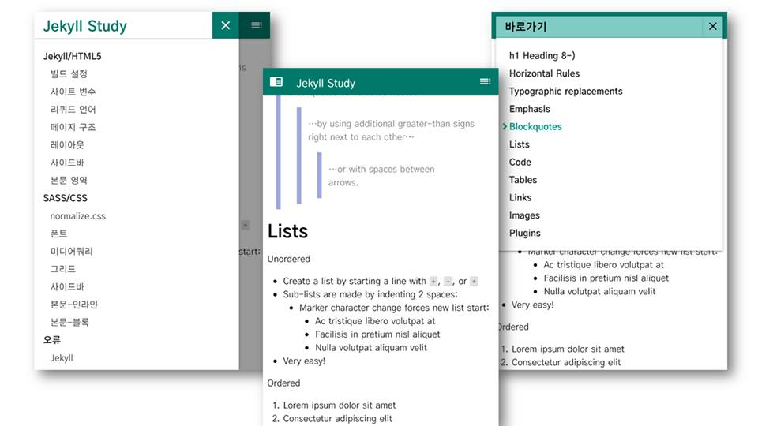
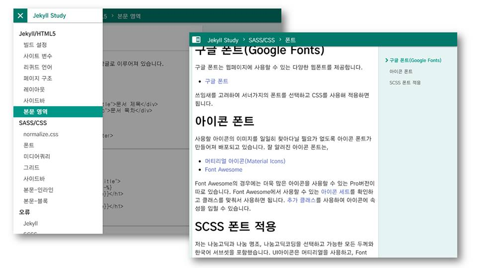
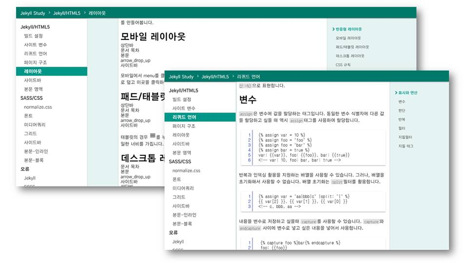

---
---

[GitHub Pages]를 위한 [Jekyll]용 테마를 제작하는 동안 배우고 느낀 것들을 정리한 문서입니다. [GitHub]의 저장소를 활용하여 온라인 교재를 만드는데 활용할 수 있는 테마로 구성하였습니다.

## 주의사항
이것은 기록 보존용으로 만든 문서입니다. 때문에 수준이 들쭉날쭉하고, 설명이 다소 불친절합니다.

# 테마 소개
목차와 문서가 분리되어 있으며, 교육목적의 소교재나 프로그램 및 라이브러리용 기술문서를 염두하고 제작하였습니다. 테마는 반응형 레이아웃을 채택하였습니다.

**외형(모바일)**

**외형(태블릿)**

**외형(PC)**

제목 태그 `<h1>`을 기준으로 문서내 목차가 자동으로 생성됩니다. 왼쪽 영역은 전체 문서 목차를 표시하고 오른쪽 영역은 문서내 목차를 표시합니다. 작은 화면에서는 상단바의 버튼을 이용해 열고 닫을 수 있습니다.

# 사용한 도구 및 자료

**HTML**은 웹페이지의 뼈대가 되는 마크업 문법입니다. 태그를 사용하여 컨텐츠를 배치합니다. 루비(Ruby)기반의 **[Jekyll]**은 HTML과 **[Liquid]**언어를 사용하여 같은 규칙을 가진 템플릿으로 작성한 문서들을 자동으로 만들어줍니다.

**CSS**혹은 **종속형 시트**는 HTML의 스타일 속성만을 따로 떼서 관리할 수 있도록 해줍니다. CSS를 활용해 문서 요소들을 꾸미거나 상호작용 일부를 관리할 수 있으며, 애니메이션 구현도 가능합니다. [Jekyll]이 기본적으로 지원하는 **[SASS]**는 기존 CSS 문법규칙에 더하여 판단, 반복, 함수, 믹스인 등 다양하고 강력한 추가문법을 사용하여 스타일을 작성할 수 있도록 돕습니다.

**스크립트**는 문서의 내용물을 제어하거나 사용자와 상호작용할 수 있도록 하는 프로그래밍 언어입니다. **[JavaScript](이하 JS)**가 잘 알려져 있습니다. JS를 사용하는 것도 좋지만 문법을 간결하고 강력하게 만들어주는 라이브러리인 [jQuery]를 활용했습니다.

**디자인 가이드라인**은 생각한 컨텐츠와 기능을 통일성 있게 만드는 규칙입니다. 색상과 폰트, 아이콘, 버튼의 모양, 레이아웃을 구성하는 요소들의 크기 등을 다룹니다. **[Material Design]**에서 안내하는 가이드라인을 참고하였습니다.

**구현 예제**들은 필요한 기능을 빠르게 습득해서 적용할수 있도록 돕습니다. 많은 경우 구글링을 통해서 습득했습니다. 그 전에 어떻게 검색해야 할지와 도구들을 조망하기 위해 HTML, JS, CSS등의 기본적인 학습은 **[W3Schools]**를 통해서 수행했습니다.

[GitHub]: https://github.com/
[GitHub Pages]: https://pages.github.com/
[Jekyll]: https://jekyllrb-ko.github.io/
[Liquid]: https://shopify.github.io/liquid/
[SASS]: https://sass-lang.com/
[JavaScript]: https://www.javascript.com/
[jQuery]: https://jquery.com/
[Material Design]: https://material.io/design/
[W3Schools]: https://www.w3schools.com/
